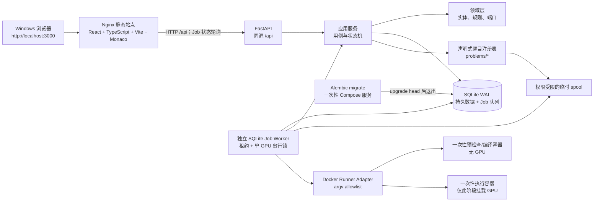
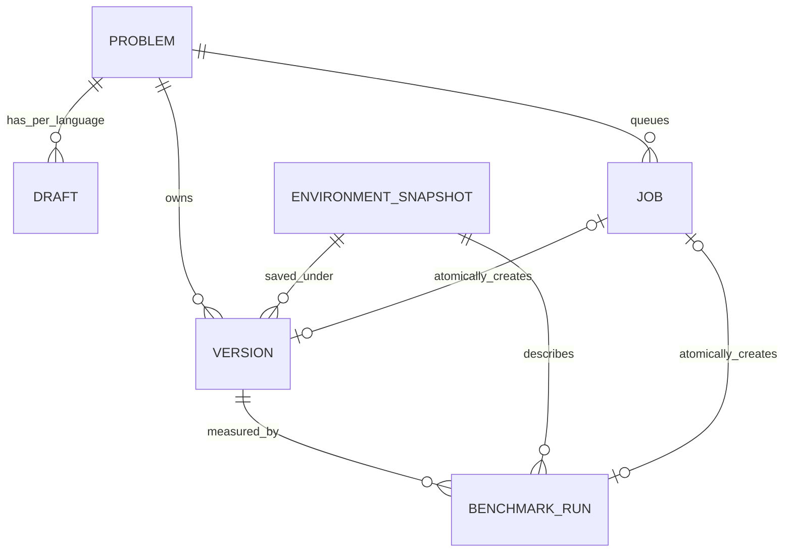
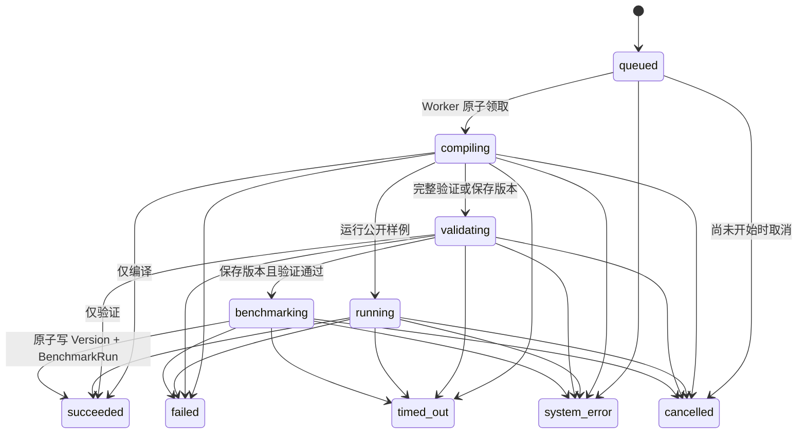
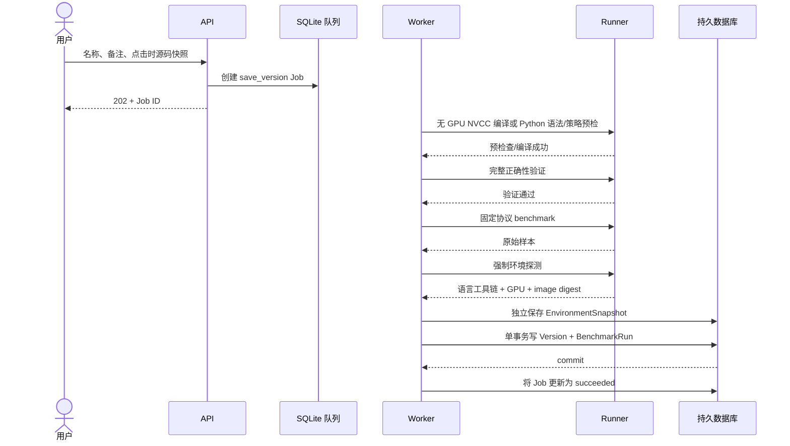

# MyLeetGpu 设计文档

## 1. 文档目的与适用范围

本文描述 MyLeetGpu 当前版本的产品语义、模块边界、数据模型、任务协议、CUDA C++ / Triton / PyTorch 执行隔离和运维策略。实现、测试和 UI 应共同遵守本文中的不变量；若接口细节发生变化，应同时更新 OpenAPI、本文和用户指南。

MyLeetGpu 是一个在 Windows + WSL2 + NVIDIA GPU 上运行的本地 GPU 编程练习环境，当前把 `cuda_cpp`、`triton_python` 和 `torch_python` 作为三种一等实现语言。前两种面向自定义 Kernel，第三种面向由基础 PyTorch Tensor 运算组合出的模型算法。它面向单机、单用户、可信操作者，但仍把待执行的 CUDA C++ / Python 源码视为不可信输入。

> 安全边界：默认宿主机唯一发布的端口是 `127.0.0.1:3000`。显式启用 LAN overlay 时，Nginx 还会在检测出的具体局域网 IPv4 上发布经过 Basic Auth 保护的 3000，并用 Windows + WSL Hyper-V 防火墙限制到 `LocalSubnet`。API 8000 始终不向宿主发布。LAN 模式只方便同一受信任网络中的单一操作者，不提供多租户隔离或传输加密；严禁公网、端口转发和不可信远程提交。

## 2. 产品目标与非目标

### 2.1 目标

- 提供简体中文的桌面端 Web 界面，浏览八道原创 GPU 题目：六道 CUDA C++ / Triton Kernel 题，以及使用 PyTorch (Python) 的多头自注意力（MHA）和分组查询自注意力（GQA）。
- 使用 Monaco Editor 编辑语言对应的 `solve` 接口，支持语言切换、starter code、重置以及按语言隔离的浏览器/服务端草稿自动保存。
- 严格区分“编译”“运行公开样例”“完整验证”和“保存为性能版本”。
- 显示经过清理和限长的 NVCC、Triton/PyTorch 提交策略、JIT、运行错误、错误答案、超时及 stdout/stderr 诊断。
- 正确性通过后，由平台 harness 使用固定协议测量 GPU Kernel 或 PyTorch attention 的性能。
- 仅在用户显式保存且验证、benchmark 均成功后，原子地持久化不可变代码版本和 benchmark。
- 比较同一题目、同一实现语言的多个版本，展示环境一致性、逐规模性能和相对 baseline 的 speedup；禁止跨语言 speedup。
- 服务重启后保留草稿、手动保存版本、benchmark 和环境快照。
- 通过声明式题目包扩展题库，而不改动 Judge 核心流程。

### 2.2 非目标

当前版本不实现：Debug、断点、单步、变量监视、cuda-gdb、Nsight、Profiler、PTX/汇编查看；应用账号、细粒度权限、多用户隔离、排行榜、讨论、公开解答和支付；Mojo、JAX、CuTe 及任意 Python 包安装；面向用户的提交/判题 CLI、云 GPU、远程部署、集群调度、AI Chat 和在线题目管理后台。LAN overlay 的 Nginx Basic Auth 只是单一共享入口凭据，不是账号系统。仓库中的 `myleetgpu.cli` 只承载 `clean-jobs`、`recover-runner` 等本机维护命令，不是另一套产品入口。

编译和普通诊断属于正常判题能力，不属于 Debug。平台不会复制 LeetGPU 的品牌、题面、starter、测试或源码；所有内置题目和测试均为本项目原创内容。

## 3. 系统上下文与架构

### 3.1 总体架构



这是一个模块化单体：Web/API/Worker 是独立进程，但共享同一领域模型和 SQLite 数据库。不引入 Redis、Celery 或 Kubernetes。默认浏览器只访问 `127.0.0.1:3000`；可选 LAN overlay 增加具体 LAN IPv4 的同端口映射和 Nginx Basic Auth。Nginx 将同源 `/api` 请求转发到 Compose 网络内的 `api:8000`。API 的默认直接运行地址是 `127.0.0.1:8000`；Compose 内部使用 `0.0.0.0:8000` 只是容器间可达要求，`8000` 没有 host `ports` 映射。

### 3.2 运行时约束

- 基础 Compose 的主机端口映射必须显式写成 `127.0.0.1:3000:...`。LAN overlay 必须绑定自动检测或显式给定的单一非回环 IPv4，拒绝 `0.0.0.0`，同时挂载认证配置；不能依赖 Docker 默认绑定。
- `make start` 先运行一次性 `migrate` 服务执行 `alembic upgrade head`；只有它成功退出，API 与 Worker 才启动。迁移失败不得用空库覆盖旧数据。
- `/api/health` 仅表示 API 进程存活；`/api/ready` 检查数据库、非空题目注册表、最近一次健康的 CUDA Runner 环境快照、`gpu:0` Worker 活跃租约及共享 GPU 熔断文件。任一条件失败均返回 503。Triton 与纯 PyTorch 工具链分别按需探测；某一 Python backend 缺失时只阻止对应 Job，不应把其他可用路径伪装为不可用。
- 编译容器和 GPU 执行容器彼此独立，均为一次性容器。
- 单张 GPU 任一时刻最多执行一个运行、验证或 benchmark Job，其余 Job 留在 SQLite 队列中。
- 普通 Job 的源码只存在于权限受限的临时 spool；完成、取消、超时或崩溃恢复后均须清除。
- CUDA C++ 固定使用 `nvidia/cuda:12.4.1-devel-ubuntu22.04`。Triton 与 PyTorch 固定共用官方 `pytorch/pytorch:2.5.1-cuda12.4-cudnn9-devel@sha256:14611869895df612b7b07227d5925f30ec3cd6673bad58ce3d84ed107950e014`，镜像内实际工具链为 Python 3.11、PyTorch 2.5.1 + CUDA 12.4、Triton 3.1。Runner 拒绝 `latest` 和 Docker 隐式拉取，读取实际 RepoDigest，并按 backend 把 GPU、工具链和镜像信息写入独立环境快照。

### 3.3 前端状态与可访问性

列表、题目、草稿、环境和版本请求都必须分别呈现 loading、empty、error 与 retry 状态，不能用空白区域代替失败信息。工作区语言切换器同步 URL 查询参数，并切换 Monaco 模式、接口说明、starter、草稿与版本计数；有 Job 或保存对话框占用当前快照时禁止切换。任务面板持续显示 Job ID、实现语言、当前阶段、进度和终态；timeout 与平台错误不得伪装成普通错误答案。危险操作用可聚焦的模态框确认，键盘可完成编辑与提交，状态不能只用颜色表达。桌面布局优先，同时在较窄窗口保持题面、编辑器和输出面板可访问。

## 4. 模块职责与依赖方向

| 模块 | 职责 | 允许依赖 | 禁止事项 |
| --- | --- | --- | --- |
| `apps/web` | 中文 UI、Monaco、草稿交互、任务状态、版本比较和环境状态 | `/api` 契约 | 直接访问数据库或 Docker；用前端时间充当 benchmark |
| `backend/myleetgpu/domain` | Job 状态、benchmark 统计/可比性，以及题目 manifest 与目录注册表 | 标准库、Pydantic、YAML 和受约束的题目文件读取 | FastAPI、SQLAlchemy、Docker 子进程 |
| `backend/myleetgpu/application` | Job 提交与 spool 生命周期、重复版本校验、版本比较等 HTTP/Worker 共用用例 | 领域层与仓储 | 拼接 shell 命令；执行用户二进制；绕过版本保存不变量 |
| `backend/myleetgpu/infrastructure` | SQLAlchemy 2 仓储、SQLite 队列、Alembic、时钟和文件 spool 实现 | 应用端口、领域层 | 把 ORM 实体泄漏到 UI；永久保留普通 Job 源码 |
| `backend/myleetgpu/runner` | CUDA/Triton/PyTorch Docker Runner adapter、语言工具链探测、提交策略、资源限制、输出清理、超时和容器清理 | Runner 端口和受控配置 | 接收任意命令、编译参数、路径或 shell 字符串 |
| `backend/myleetgpu/api` | FastAPI 路由、Pydantic 校验、错误映射、OpenAPI | 应用层 | 在请求线程直接运行 NVCC/Docker |
| Worker | 原子领取 Job、维护租约，并编排编译、运行、验证、保存、重测、清理和熔断 | Domain、Application、Repository 与 Runner adapter | 并发使用同一 GPU；在日志中泄漏内部测试 |
| `alembic` / `migrate` | 管理 schema revision；Compose 启动前一次性执行 `upgrade head` | SQLAlchemy metadata、SQLite | 迁移失败后用空库覆盖持久数据 |
| `problems` | 公共题面、分语言说明/starter/接口、可信 validator/benchmark harness 和测试声明 | 题目 schema v2 | 将题目特例写进 Judge 核心 |

当前实现是清晰分区的模块化单体，而不是强制每一层都经抽象 port 的 Clean Architecture：API 调用 Application 和 Repository，Worker 直接协调 Domain、Repository 与 Runner adapter。关键边界是不变的——FastAPI 请求线程不运行 Docker，业务用例不构造 shell；Docker 命令只由 Runner adapter 根据固定模板生成，并以参数数组传给进程 API。

## 5. 题目协议

### 5.1 目录结构

每道题是独立、版本化的声明式包：

```text
problems/<slug>/
├── problem.yaml
├── statement.md
├── starter.cu
├── instructions/
│   ├── cuda_cpp.md
│   ├── triton_python.md
│   └── torch_python.md
├── include/
│   └── solve.h
├── harness/
│   ├── validator.cu
│   └── benchmark.cu
├── triton/
│   ├── starter.py
│   └── harness/
│       ├── validator.py
│       └── benchmark.py
└── torch/
    ├── starter.py
    └── harness/
        ├── validator.py
        └── benchmark.py
```

CUDA C++ 用户只能实现 `solve.h` 约定的接口；Triton 用户文件必须提供 manifest 声明的 Python `solve(...)`，可在同一文件定义 `@triton.jit` Kernel，但只能使用 `restricted_triton_v1` 白名单允许的模块结构、launcher 和 Triton DSL。PyTorch 用户文件按 manifest 定义一个精确签名的 `solve` 或受限普通 class；当前 MHA/GQA 使用由平台注入固定权重的 class，唯一前向入口为 `forward(X, isCasual)`。`restricted_torch_v2` 只允许基础 Tensor 变换、矩阵运算、mask 和 softmax，并拒绝继承、额外方法、forward 状态写入、现成 SDPA、I/O、反射、动态执行、进程与原地输出逃逸。入口、数据生成、拷贝、受控 stream、同步、参考实现、结果验证和计时均由语言对应的可信平台 harness 控制。题目包只需包含自己声明的实现目录；算子题与 attention 题不必支持相同语言。

### 5.2 Manifest 最低字段

`problem.yaml` 至少声明：

- `slug`、标题、难度和递增的题目 `revision`；
- `default_language` 与按 `cuda_cpp` / `triton_python` / `torch_python` 键控的 `implementations`；每个实现独立声明函数签名、starter、语言补充说明、harness 和固定工具链 profile；
- 公共的输入输出类型与约束；
- 整数精确比较或浮点 `atol`/`rtol`，以及 NaN/Inf 处理策略；
- 公开、边界和内部测试配置；
- benchmark 输入规模、固定随机种子、warmup、samples/iterations、极短 kernel 的 inner repetitions；
- 编译、运行、验证和 benchmark timeout；
- CUDA 实现只能从平台 allowlist 中选择编译配置，不能包含任意用户 flags；Triton 与 PyTorch 实现分别只能选择固定的 `triton_torch_cuda_v1` / `torch_cuda_v1`、`python3` 和对应的版本化受限提交策略。

API 和 Worker 各自在进程启动时加载并以 schema 校验所有 manifest，同时验证引用文件位于题目目录内、slug 唯一、revision 合法、测试和 benchmark 配置完整。任一题目无效时对应进程启动失败，Compose 的健康/就绪检查不能成功，维护者从启动日志获得错误；不能静默忽略。

每种实现语言独立计算 `suite_hash`：覆盖该实现的 benchmark harness、CUDA 公开接口头或声明的支持文件，以及规范化后的公共 `benchmark` manifest（其中含输入规模、种子、warmup、iterations 和协议版本）。validator、公开/内部正确性配置的变化通过 problem revision 表达；修改任何影响正确性语义的内容必须增加 revision，修改性能口径还会自然改变对应语言的 suite hash。新增符合 schema v2 协议的目录不需要修改核心 Judge。

## 6. 核心数据模型

数据库使用 SQLAlchemy 2 和 Alembic 管理 schema，并在每次连接时启用 SQLite `foreign_keys=ON`、WAL、`busy_timeout=30000` 和 `synchronous=NORMAL`。Compose 的一次性 `migrate` 服务负责在 API/Worker 之前运行 `alembic upgrade head`；本地开发也可使用 `make migrate`。事务应短小；耗时的编译和运行绝不能持有数据库写事务。

### 6.1 `Draft`

- `id`、`problem_id`、`language`；单用户模式下每个 `(problem_id, language)` 至多一个活动草稿；
- 当前源码和更新时间。

草稿可变，不是性能版本。当前服务端按题目和语言 upsert/后写覆盖；浏览器本地回退 key 也包含语言。CUDA、Triton 与 PyTorch 草稿互不覆盖。自动保存、重置、编译、运行和验证均不得创建 `Version`。

### 6.2 `Version`

- `id`、`problem_id`、`problem_revision`、`language`；
- 用户可修改的名称和备注；
- 不可变的完整源码快照和 `source_hash`；
- 创建时间和正确性通过状态；
- 保存时的规范化执行配置、suite/protocol 标识；
- 与初次 `BenchmarkRun` 的关系。

版本的语言、源码、题目 revision 和初次测量语义不可修改。重命名或改备注只更新元数据。删除版本必须在 UI 二次确认，API 还要求 `confirmed=true`，并在事务中级联删除关联 benchmark。重复源码检查限定在同题、同语言；前端先提示，服务端也在入队、Worker 开始和最终提交前复查，只有显式 `allow_duplicate=true` 才允许继续。

### 6.3 `Job`

- `id`（也是全链路 correlation ID）、动作类型、题目、revision 与 `language`；
- 状态、创建/开始/结束时间、进度阶段和领取它的 `worker_id`；
- 结构化错误类别、安全化诊断和总量受限的合并输出；
- source hash 和临时 spool 引用；不永久保存重复源码；
- 保存性能版本时的候选名称/备注，或重测时的版本 ID 列表，保存在受控 payload 中。

Job 元数据目前保留在 SQLite 中；源码和编译产物不随 Job 永久保存。单 GPU 互斥由独立的 `ResourceLease` 记录承担，不是每个 Job 自带租约。

### 6.4 `BenchmarkRun`

- `id`、`version_id`、`environment_snapshot_id`、创建时间；题目 revision 由关联 Version 给出；
- suite hash、benchmark protocol version；
- 执行配置、输入规模、固定种子、warmup、samples/iterations、inner repetitions；
- 每个规模的限量原始样本，以及 median、p95、min、CV 和 MAD。

一个 `Version` 可以因“在当前统一环境重测”关联多个 `BenchmarkRun`；历史运行不可原地改写。当前比较 API 自动选用按创建时间和 ID 排序后的最新运行，不提供手工选择历史 BenchmarkRun 的参数。

### 6.5 `EnvironmentSnapshot`

- `backend`（`cuda_cpp`、`triton_python` 或 `torch_python`）、GPU 型号和 Compute Capability；
- Windows/WSL 可见的驱动版本，以及语言对应的工具链：CUDA Runtime/NVCC、Python/PyTorch/Triton/Torch CUDA，或 Python/PyTorch/Torch CUDA；
- 固定的语言 Runner 镜像引用及实际 image digest；
- 集中探测所得的 CUDA 架构；
- 可用时的温度、SM 时钟、功耗和 GPU busy；不可获得时存为 `null`，API/UI 显示 `unavailable`。
- `created_at` 保持快照创建时间；`observed_at` 记录该环境最近一次受信探测时间。同 fingerprint 的未引用状态行可刷新 `observed_at`，Version/BenchmarkRun 引用的测量快照不原地改写。

实现语言、稳定的工具链和硬件字段经规范化后计算 `environment_fingerprint`。Triton 指纹包含 Python、PyTorch、Triton、Torch CUDA、镜像 digest 与目标架构；PyTorch 指纹包含 Python、PyTorch、Torch CUDA、镜像 digest 与目标架构；CUDA 指纹包含 CUDA Runtime、NVCC、镜像 digest 与目标架构。温度、瞬时时钟、功耗和 GPU busy 等易变遥测只随快照记录，不参与 fingerprint，否则同一机器的连续运行会被错误判为不同环境。不能用空字符串或伪造值补齐 WSL 无法提供的遥测。

### 6.6 关系概览



`PROBLEM` 主要来自文件注册表；数据库只存其稳定标识和运行时引用。

## 7. API 契约

所有 API 均位于同源 `/api` 并使用 JSON。同步错误统一放在 `error` envelope：至少有 `code/message`，参数校验可带 `details`，重复源码的 409 可带 `duplicates`。异步 Job 失败则在 Job 的 `error` 中返回稳定的 `code`、`message`、`stage`、`retryable` 和受限 `details`。服务器始终再次校验 problem slug、代码大小、名称、备注和枚举；不能信任前端校验。FastAPI 的 Trusted Host allowlist 仅接受 localhost、loopback、测试主机和 Compose 内服务名，且没有开放式 CORS。

当前实现的资源如下；服务生成的 OpenAPI 是机器可读契约：

| 方法与路径 | 语义 |
| --- | --- |
| `GET /api/health` | 进程存活检查，不触发 GPU 操作 |
| `GET /api/ready` | 检查数据库、题目、健康 CUDA 环境快照、Worker 活跃租约和共享 GPU 熔断文件；不就绪时返回 503 |
| `GET /api/environment?language=...` | 指定语言最近一次 GPU/Runner 环境快照；默认 `cuda_cpp`，熔断状态以 `/api/ready` 为准 |
| `GET /api/problems` | 题目摘要列表 |
| `GET /api/problems/{slug}` | 题面、`default_language`、各语言 implementation 的签名/starter/说明、限制和 revision；不返回内部测试 |
| `GET /api/drafts/{problem_id}?language=...` | 获取该题指定语言的草稿；省略语言时采用题目的 `default_language` |
| `PUT /api/drafts/{problem_id}` | 按 `(problem_id, language)` upsert 草稿；省略语言时采用题目的 `default_language`，当前为后写覆盖 |
| `POST /api/jobs` | 创建 `compile`、`run`、`validate`、`save_version` 或 `rebenchmark` Job；语言可省略并解析为题目的 `default_language`，返回 202 和 Job ID |
| `GET /api/jobs/{job_id}` | 获取状态、阶段、逐公开用例结果和受限诊断 |
| `GET /api/problems/{problem_id}/versions?language=...` | 可按语言列出手动保存版本和 benchmark 摘要；省略时列出该题全部实现语言 |
| `PATCH /api/versions/{version_id}` | 仅修改名称和备注 |
| `DELETE /api/versions/{version_id}?confirmed=true` | UI 二次确认后删除；缺少/否定确认参数返回 409 |
| `GET /api/versions/duplicates?problem_id=...&language=...&source_hash=...` | 保存前在同题同语言内查询重复源码并提示用户；省略语言时采用题目的 `default_language` |
| `POST /api/versions/compare` | 比较同题的 2 至 8 个唯一版本并指定其中一个 baseline；正常 UI 请求携带语言并拒绝不匹配版本，省略语言的兼容调用仍会把混合语言标为不可比较且不生成 speedup |
| `GET /api/docs`、`GET /api/openapi.json` | 本地交互式 API 文档和 OpenAPI schema |

保存版本和重测都通过 `POST /api/jobs` 进入同一状态机，`language` 是一等字段：`save_version` 请求还携带名称、备注、点击时源码和 `allow_duplicate`。服务在入队、Worker 开始及最终提交前按同题同语言检查重复；发现重复且未显式允许时返回/记录冲突，`allow_duplicate=true` 才允许继续。`rebenchmark` 请求携带同题、同语言的 1 至 8 个唯一版本 ID，混合语言会被拒绝。MVP 没有取消路由；状态枚举保留 `cancelled` 供受控关停或后续取消协议使用，浏览器断开不等同于取消 Job。

长任务接口不阻塞 HTTP 请求。MVP 可通过有退避的轮询获取 Job 状态；若以后引入 SSE，只改变传输方式，不改变 Job 状态机。API 返回的内部对象路径、内部输入和参考输出必须经过投影/清理，不能把数据库模型直接序列化给浏览器。

## 8. Job 状态机与并发

### 8.1 状态



终态为 `succeeded`、`failed`、`timed_out`、`cancelled`、`system_error`。其中 `failed` 表示可归因于提交内容的编译失败、错误答案、运行错误或输出超限；`system_error` 表示平台、Docker、数据库或 GPU 健康异常。错误类型应进一步结构化，避免用户从文本猜测。

### 8.2 队列和单 GPU 互斥

Worker 启动时先获取 SQLite 中唯一的 `gpu:0` 资源租约，并每 5 秒续约（租约 TTL 30 秒）；拿不到租约的第二个 Worker 拒绝运行。持有租约的单 Worker 使用短事务原子领取最早的 `queued` Job，并逐个执行整个 Job。即便多个 API 请求并发到达，也只能有一个 Job 进入实际处理，因此 GPU 阶段严格串行。

Worker 启动时只清理同时带 Runner 标记和当前 installation 标记的遗留一次性容器，不按 Compose 名称模糊匹配。租约续约或 owner 校验失败时，旧 Worker 立即停止轮询并删除带自身 owner 标记的在途容器。属于旧 Worker 且停在 `compiling/running/validating/benchmarking` 的 Job 被标记为 `system_error`，对应 spool 随后清理；尚未领取的 `queued` Job 保持排队。系统不会自动重放已开始的 Job，从而避免不确定的重复持久化。保存版本的 Version 与首次 BenchmarkRun 仍由单个数据库事务保护。

## 9. 四种操作的数据流

### 9.1 通用入口

1. API 校验题目 revision、实现语言、动作、源码字节数和可选元数据。
2. 将点击时源码快照写入权限受限、不可由用户指定路径的 Job spool；数据库只记录 hash 和 opaque 引用。
3. 在短事务中创建 `queued` Job，立即返回 Job ID。
4. Worker 领取任务，将题目可信文件和用户源码复制到该 Job 的精确工作目录。
5. Runner 根据实现语言和动作选择固定镜像、固定命令模板和 allowlist 配置。
6. 无论成功、失败、取消或超时，均执行容器及临时目录清理。

### 9.2 编译

```text
CUDA:   源码快照 → 无 GPU 编译容器 → NVCC → 清理/截断诊断 → 清理产物 → Job 终态
Triton: 源码快照 → 无 GPU 预检查容器 → 语法 + restricted_triton_v1 策略检查 → 清理/截断诊断 → Job 终态
PyTorch: 源码快照 → 无 GPU 预检查容器 → 语法 + restricted_torch_v2 策略检查 → 清理/截断诊断 → Job 终态
```

预检查/编译容器不获得 GPU，只生成临时产物，不创建 Version 或 BenchmarkRun。CUDA C++ 动作用 NVCC 完成编译和 harness 链接。Triton 预检先解析 AST，拒绝非白名单 import、模块级执行、反射、I/O、进程/线程、打印、dunder、动态执行及非白名单调用；随后在隔离 globals 中只加载字面量常量、`@triton.jit` 定义和直线式 `solve` launcher，不调用 `solve`，也不进行 GPU JIT。第一次带真实 Tensor 的 GPU 调用才完成对应参数/`tl.constexpr` 的 JIT 专化，因此 Triton“编译成功”不代表 Kernel 已经成功 JIT。PyTorch 预检使用独立的 `restricted_torch_v2`，只加载字面量常量与单个精确 `solve`，或一个无继承且仅含 `__init__` / `forward` 的精确 class；MHA/GQA 构造器只能保存平台权重，forward 不能写实例状态。策略允许题面列出的基础 Tensor 组合，拒绝现成 attention、I/O、反射、动态执行、任意 helper、原地属性/下标赋值与 `out=`。诊断会删除宿主机路径、spool 路径和内部 harness 路径，保留用户文件名、行列号和关键错误；Runner 合并捕获 stdout/stderr，并对合并后的字节总量设限、标注超限或截断。

### 9.3 运行公开样例

```text
源码快照 → 无 GPU 编译 → GPU 运行容器 → 逐公开用例结果 → 清理 → Job 终态
```

只有预检查/编译成功后才创建 GPU 容器。CUDA 运行临时程序；Triton harness 通过同一版本化策略把源码加载到独立 module globals，严格校验 `solve` 参数，并在第一次可信调用时触发 JIT 专化；PyTorch harness 以独立策略加载 `solve`，检查返回 Tensor 的设备、dtype、形状、有限值、数值误差和输入不可变性。返回每个公开用例的 pass/fail、公开输入摘要、错误类别和必要输出；不创建版本。容器初始化、Triton 首次 JIT 和用例准备等不作为可持久化性能成绩。

### 9.4 完整验证

```text
源码快照 → 无 GPU 编译 → 公共 + 边界 + 固定种子内部测试 → 聚合结果 → 清理
```

整数逐元素精确比较。浮点值使用题目配置的 `abs(actual-expected) <= atol + rtol * abs(expected)`；NaN 仅在协议明确允许且两侧对应为 NaN 时相等，`+Inf`/`-Inf` 必须符号一致。内部输入、参考输出、随机种子派生细节和 harness 路径不能出现在响应或日志中。验证只返回测试分组、通过数和安全化的首个错误摘要，不创建版本。

### 9.5 保存为性能版本



这是唯一创建 `Version` 的动作。源码在点击时即冻结；之后编辑草稿不会影响正在保存的版本。只有重新完整验证和 benchmark 全部成功，才在单个数据库事务内创建 Version 与 BenchmarkRun；事务提交后再把 Job 标为成功。环境快照在此之前独立持久化，所以失败的保存尝试可以留下环境事实，但不得留下 Version 或 BenchmarkRun。任一步骤失败、超时、取消或版本事务回滚，Version 数量都必须保持不变。

## 10. Benchmark 协议

### 10.1 计时边界

- 仅平台选定语言的 benchmark harness 计时有效；完全忽略用户打印的时间。
- benchmark 前必须使用同一源码快照重新完成完整正确性验证。
- 单 GPU 串行执行，benchmark 之间不得重叠。
- NVCC/Python 预检查、Triton 首次 JIT 专化、容器创建、CUDA context 初始化、输入生成、设备内存分配和 H2D/D2H 拷贝均在计时区间外；PyTorch 返回 Tensor 的分配属于被测 `solve` 本身，计入其 GPU 时间。
- 在同一 CUDA stream 上记录成对 CUDA Events；起点 event 在被测 kernel 前，终点 event 在 kernel/inner repetitions 后，并对终点正确同步。
- 先完成配置规定的 warmup，再采集多次独立样本。极短 kernel 在一个 event 区间内执行固定 inner repetitions，以总 elapsed time 除以 repetitions。
- 正式采样前，benchmark harness 在 warmup 后做一次 D2H 正确性保护检查；该拷贝和比较位于计时区间外。采样区间本身不混入 D2H 拷贝，且保存/重测流程此前已经完成独立的完整验证。
- 每个输入规模单独记录协议参数和样本，不以单次最好值代表稳定性能。
- MVP 不静默剔除“看起来太慢”的成功样本；所有成功采样进入统计。CUDA error、样本缺失或非有限耗时使整次 BenchmarkRun 失败。未来若增加异常值规则，必须提升协议版本并持久化规则。

### 10.2 统计量

对每个输入规模，保存受限数量的有效原始耗时样本，并计算：

- `median`：主指标，排序后中位数；
- `p95`：按协议固定的 nearest-rank 规则计算尾部耗时；
- `min`：仅用于诊断，不作为排名依据；
- `CV = population_stddev / mean`：均值非零时报告；
- `MAD = median(|x - median(x)|)`：对异常值更稳健的波动指标；
- `sample_count`：有效样本数，必须与配置匹配，否则本次运行失败而非悄悄少算。

单位在存储中使用不会丢失精度的整数纳秒或明确标注的小数毫秒，API 和 UI 必须带单位。不能把舍入后的显示值用于再次计算。

以版本 B 为 baseline、版本 X 为候选时：

```text
speedup(X) = median(B) / median(X)
```

大于 `1.0x` 表示候选更快，小于 `1.0x` 表示更慢。UI 同时显示原始 median，防止只看比值造成误读。

### 10.3 可比性

只有以下比较键全部相同，两个 BenchmarkRun 才标记为“可直接比较”：

- 同一 problem slug 和 problem revision；
- 同一实现语言；CUDA C++、Triton 与 PyTorch 即使运行在同一 GPU 上也不进入同一比较请求；
- 同一 suite hash 和输入规模集合；protocol version、随机种子、warmup 与 iterations 已纳入 suite hash，但仍单独展示；
- 同一规范化执行配置；CUDA 记录 flags 与目标架构，Triton 记录 backend、策略、Python/PyTorch/Triton/Torch CUDA 与目标架构，PyTorch 还记录策略、matmul precision、TF32 与确定性设置；
- 同一 environment fingerprint（包括语言、GPU/Compute Capability、驱动、对应工具链和 Runner 镜像 digest 等）。

UI 首先按语言分组，正常比较请求携带当前语言，API 会拒绝与该显式语言不匹配的版本。兼容调用省略语言时，后端仍把混合语言标为不可比较且不生成 CUDA C++、Triton 与 PyTorch 之间的 speedup。对于同语言版本，任何其余字段不一致时，UI 必须明确标为“不可直接比较”，列出差异，不能生成统一排名或具有误导性的总 speedup；可以并排展示历史原始数据。用户可选择“使用当前统一环境重新测试所选版本”；系统先串行验证全部所选版本，再串行 benchmark 全部版本，并按 10.4 节批量追加新的 BenchmarkRun，不改变源码版本。

比较页对每个输入规模展示 median、p95、CV/MAD、样本数和相对 baseline 的 speedup，并同时展示实现语言、GPU、驱动、CUDA/NVCC、Python/PyTorch/Triton 或纯 Python/PyTorch 工具链、执行配置、镜像 digest、suite hash 与协议版本。源码快照应只读展示，优先用 Monaco Diff 做两两差异查看；超过两个版本时由用户选择 diff 的左右两侧。

温度、频率、功耗限制和后台 GPU 工作负载会造成波动。WSL2 未必能提供温度、时钟或 GPU busy，这些字段应显示 `unavailable`。即使 fingerprint 相同，本机结果也只是同一机器、相近运行条件下的经验测量，不代表跨机器绝对排名。

### 10.4 统一环境重测的批处理语义

`rebenchmark` 接受同题、同语言的 1 至 8 个唯一版本，拒绝混合语言以及已经不是当前 problem revision 的版本。Worker 先按请求语言探测并保存统一环境快照，然后严格分成两阶段：

1. **验证阶段：**按请求顺序逐个编译并执行所有版本的完整验证；任一版本失败就终止，尚未产生新的 BenchmarkRun。
2. **测量阶段：**只有全部版本验证通过后，才按同一顺序逐个编译 benchmark harness 并采样；结果先保存在 Worker 内存中，不逐条提交。
3. **提交阶段：**全部测量成功后，使用一个 SQLite 事务批量追加所有 BenchmarkRun。任一测量或事务失败，本批次向版本追加的 BenchmarkRun 数量为零。

重测不创建 Version，也不改变版本源码、名称或备注。环境探测快照属于独立运行事实，可能在批次失败时仍被保留；原子性承诺针对所选版本的新 BenchmarkRun 集合。

## 11. Kernel 执行威胁模型与安全边界

### 11.1 假设与保护目标

CUDA 提交可以是任意能被 NVCC 接受的 CUDA/C++；Triton 提交必须通过版本化 AST 白名单，只能包含精确 import、受限字面量常量、`@triton.jit` 函数和直线式 `solve` launcher；PyTorch 提交必须通过另一套版本化 AST 白名单，只能包含精确 `import torch`、受限字面量常量和单个 `solve`。用户代码仍可能造成资源耗尽、越界访问或 GPU/运行时异常。容器和 Runner 需要保护仓库、数据库、Docker daemon、主机普通文件和服务可用性，并避免内部测试经产品输出泄漏。

PyTorch 策略还必须保证 benchmark 所依赖的无持久状态不变量：模块常量只能是不可变标量或递归不可变 tuple，`solve` 及每层条件分支都重复执行语句白名单，禁止 helper、循环、嵌套 import、增量/原地赋值和全局状态修改。这样同一输入在固定确定性环境中的各次调用不能根据隐藏调用计数改变算法；benchmark 才可以在预热前、预热后和计时后进行代表性正确性复查，而不是把用户可控状态当成可信前提。

本地操作者本身被视为可信：他可以访问工作站、仓库和 Docker。项目不尝试防御拥有 Windows/WSL/Docker 管理权限的用户。

Worker 是受信控制平面组件。为了创建一次性容器，它可能需要访问 Docker socket；这等价于很高的宿主权限，因此 socket 只能挂给 Worker，不能挂给 API、Web 或用户代码容器。Worker 进程本身绝不加载用户动态库或直接执行用户二进制，所有不可信编译/运行只能发生在受限容器中。

### 11.2 容器策略

编译和执行容器均必须满足：

- 按语言固定 `nvidia/cuda:12.4.1-devel-ubuntu22.04` 或官方 PyTorch 2.5.1 CUDA 12.4 devel 镜像的审计 digest，并记录实际 RepoDigest，禁止 `latest`；
- 非 root UID/GID，`--network none`，只读 root filesystem；
- CUDA 容器只提供 64 MiB、`nosuid,nodev,noexec` 的 `/tmp` tmpfs。Triton 为 JIT 生成和加载缓存提供 512 MiB、`nosuid,nodev,exec` 的 `/tmp` tmpfs；纯 PyTorch 提供 512 MiB、`nosuid,nodev,noexec` 的 `/tmp`，因为该题型不允许运行时编译。Python 缓存目录均指向临时区；除该临时区外仍禁止写入镜像其他位置；
- `--cap-drop=ALL`、`no-new-privileges=true`，并保留 Docker 默认启用的内置 seccomp profile（绝不使用 `seccomp=unconfined`）；
- private PID/IPC，不使用 host PID、host IPC 或 host network；
- 默认 2 CPU、2 GiB memory/swap、128 PID、64 MiB 文件大小，以及可配置的合并 stdout/stderr 上限；
- 编译、运行、验证、benchmark 各自独立的 wall-clock timeout；
- 使用平台生成的容器名/路径/ID，所有命令以参数数组执行；题目、动作、镜像和编译 flags 都来自 allowlist。

不同阶段的挂载和设备权限有意不同：

| 语言与阶段 | 精确 bind mount | 写权限 | GPU |
| --- | --- | --- | --- |
| CUDA 编译 | 当前 Job 下的 `compile-validator/` 或 `compile-benchmark/`，仅含规范化 `source.cu`、`solve.h`、选定的 `platform.cu`，以及本阶段生成的 `program` | `/work` 可写，以便非 root NVCC 生成临时目标和可执行文件 | 无，不传 `--gpus` |
| Triton 预检 | 当前 Job 下的对应 `compile-*`，仅含只读 `source.py`、选定的 `platform.py` 与 `submission_policy.py` | bind mount readonly；Python 执行语法/AST 白名单与安全定义加载，临时文件写入 `/tmp` | 无，不传 `--gpus` |
| PyTorch 预检 | 当前 Job 下的对应 `compile-*`，仅含只读 `source.py`、选定的 `platform.py` 与 PyTorch `submission_policy.py` | bind mount readonly；Python 执行语法/AST 白名单与安全定义加载 | 无，不传 `--gpus` |
| CUDA 公开运行/完整验证/benchmark | 新建的 `run-public/`、`run-full/` 或 `run-benchmark/`，只复制最终 `program` | bind mount readonly，程序只读/可执行 | 仅 `--gpus device=0` |
| Triton 公开运行/完整验证/benchmark | 新建的对应 `run-*`，只复制 `source.py`、选定的 `platform.py` 与版本化 `submission_policy.py` | bind mount readonly；JIT 缓存只写入 512 MiB `/tmp` | 仅 `--gpus device=0` |
| PyTorch 公开运行/完整验证/benchmark | 新建的对应 `run-*`，只复制 `source.py`、选定的 `platform.py` 与版本化 `submission_policy.py` | bind mount readonly；临时缓存只写入 noexec `/tmp` | 仅 `--gpus device=0` |

用户容器从不挂载仓库根目录、数据库、Docker socket或宽泛宿主目录。禁止 `--privileged`。正常退出依靠 `--rm`；超时或输出超限时 Runner 强制删除已知容器名，Job 的 `finally` 再清理整个 spool。Worker 重启只按 `com.myleetgpu.runner=true` 与当前 installation 双重 label 回收遗留容器；租约丢失时再加 owner label 限定，不会匹配 API、Worker、Web 或其他 clone 的 Compose 容器。

CUDA 编译阶段需要平台 harness 完成链接，运行容器只接收最终二进制；Triton 必须在 GPU 阶段加载受限定义并 JIT；PyTorch 则在 GPU 阶段加载受限的高层 Tensor 函数。两类 Python 只读运行目录都包含 `source.py`、选定的单个平台 harness 和无测试数据的策略 sidecar。策略拒绝文件读取、反射、动态执行、打印及结果通道伪造，harness 在加载提交前捕获可信判定、计时和结果编码引用。所有语言都不挂载题目仓库或其他测试文件。对浏览器的响应和普通日志还会过滤内部测试输入、参考输出及真实 harness/Job 路径。由于本项目面向能直接读取本地仓库的可信操作者，“内部测试不泄漏”是产品输出边界，而不是针对本机管理员的保密承诺。

### 11.3 无法提供的保证

NVIDIA 容器运行时仍共享宿主内核、Windows 驱动和物理 GPU。RTX 4060 这类消费级 GPU 没有面向不可信租户的 MIG 切分；Docker 的 CPU/内存限制也不能完整限制显存、GPU 执行时间或驱动攻击面。恶意 kernel 可能拖慢其他图形/GPU 工作、使 CUDA context 或设备失效，极端情况下需要重启 WSL、Docker Desktop 或 Windows。缓存、时序和残留显存等侧信道也不在 MVP 的强隔离保证内。

因此，“认证入口 + 容器”只是在可信单机/局域网前提下的纵深防御，不构成公网沙箱、安全边界证明或多租户隔离。若未来需要接收不可信远程用户，必须改为独占机器/虚拟机或可验证的硬件级隔离，并加入身份、授权、速率限制、审计、传输加密和主机级恢复机制。

Validator/benchmark harness 与提交仍处于同一最终进程：CUDA 通过链接，Triton/PyTorch 通过各自的受限定义加载。CUDA 的结果 sentinel 不是抗主动作弊的加密边界；`restricted_triton_v1` 与 `restricted_torch_v2` 会在执行前拒绝 host I/O、反射、进程终止、打印和非白名单调用，从而阻断已知的 harness 读取及伪造 sentinel/样本路径，但它们不是通用 Python 沙箱的形式化安全证明。平台仍只面向可信本机/LAN 操作者，不应把当前结果用于不可信用户排名或公网竞赛；若要接收对抗性远程提交，必须把受信判定与用户执行拆到独立保护域和结果通道。

## 12. 错误处理、熔断与恢复

### 12.1 错误分类

| 类别 | 示例 | 用户可见行为 |
| --- | --- | --- |
| `compile_error` | NVCC 语法/类型/链接错误，Python 语法/策略错误，或第一次 GPU 调用中的 Triton JIT/PTXAS 错误 | 行列号和清理后的诊断；Triton 会标明语法检查或 GPU 专化阶段 |
| `wrong_answer` | 值不匹配、非法 NaN/Inf | 公开测试可显示有限详情；内部测试只显示安全摘要 |
| `runtime_error` | 非零退出、CUDA error、非法访问或 Python 运行异常 | 稳定错误码、退出信息和限长合并输出 |
| `output_limit` | 合并 stdout/stderr 超限 | 终止任务并明确标注输出超限 |
| `timeout` | 任一阶段超过 wall time | Job 进入 `timed_out`，终止容器并清理 |
| `runner_unhealthy` | GPU/驱动/容器探测、固定语言镜像缺失或运行链路异常 | Job 进入 `system_error`；共享 GPU 熔断或仅语言工具链不可用由诊断区分 |
| `invalid_request` | 版本、题目或动作参数不合法 | 拒绝执行，返回可操作原因 |
| `internal_error` | 数据库、Worker 或未分类平台异常 | Job 进入 `system_error`，不归咎用户代码 |

外部错误响应不包含 Python traceback、宿主绝对路径、内部测试输入/期望输出、Docker socket 信息或环境秘密。完整结构化日志只记录必要字段，使用 Job ID 串联 API、Worker 与 Runner，并对源码、备注和诊断做敏感字段控制。

### 12.2 GPU 熔断

若提交进程输出出现 GPU 丢失、驱动不兼容、NVML 初始化失败或 Xid 等候选健康故障，Runner 会先运行独立、受信的 GPU 探针；只有该探针也失败才在 `data/runner-unhealthy.json` 写入持久熔断标记，用户 stdout 本身不能触发熔断：

1. 当前 Job 标为 `system_error` 或相应超时，不保存 Version；
2. 阻止后续 GPU Job 开始，已排队任务保持可见；
3. 后续 Runner 操作读取标记后拒绝执行；`/api/ready` 读取该标记并返回 503，环境页和 Job 错误提供最近探测结果与原因；
4. 操作者清理残留 Job、检查 `nvidia-smi` 和 GPU 容器、必要时重启 Docker/WSL；
5. `make doctor` 真实通过后执行 `make recover-runner`；该命令会忽略旧标记重新探测，只有探测成功才删除标记并保存新的健康环境快照。

不得为了继续处理队列而伪造 GPU 健康。若消费级 GPU 被 kernel 弄到必须重启 Windows 的状态，文档应如实提示人工恢复。

### 12.3 进程和数据库恢复

- Worker 只有在旧的 `gpu:0` 租约过期后才能接管；启动时按 Runner + installation labels 清理孤儿容器，租约丢失时只清理自身 owner label 容器，并把旧 Worker 的活动 Job 标为 `system_error`，未领取 Job 保持排队。
- Worker 收到 SIGTERM/SIGINT 后停止继续轮询；若进程在容器调用期间被强制结束，下一次启动执行上述孤儿恢复。
- SQLite 写入使用事务。保存版本时只有 Version 与首次 BenchmarkRun 在同一事务创建；环境快照先独立保存，Job 成功状态在工作完成后另行提交。
- Compose 启动先运行 `migrate` 一次性服务执行 Alembic；退出码非零会阻止 API/Worker 启动，不能用空库覆盖原数据库。
- 若 SQLite 报损坏，立即停止写入，保留数据库及 `-wal`/`-shm` 文件供备份与诊断，不自动删除或重建。

## 13. 数据保留、删除与清理

默认持久化根目录为仓库下 `./data/`，数据库是 `./data/myleetgpu.db`，临时任务区是 `./data/jobs/`；这些路径必须被 Git 忽略。容器内对应 `/data`，自定义部署若修改数据目录，必须让 API、Worker 和 Docker Runner 使用同一经解析的绝对位置，并且只挂载所需的精确子路径。

| 数据 | 默认保留 | 清理方式 |
| --- | --- | --- |
| Draft 源码 | 持久，当前无独立删除 API | 编辑/重置会覆盖；删除仅随完整数据重置 |
| Version 源码、名称、备注 | 持久，直到二次确认删除 | 版本 UI/API；事务级联关联记录 |
| BenchmarkRun | 随 Version 持久 | 删除 Version 时由外键级联删除 |
| EnvironmentSnapshot | 启动/恢复探测可复用同 fingerprint 记录；保存/重测保留当次快照 | MVP 不自动回收已无引用的快照 |
| Job 元数据和限长诊断 | 持久；MVP 尚无按时间/数量自动裁剪 | 仅随完整数据重置 |
| Runner 熔断标记 | 仅健康故障后存在于 `data/runner-unhealthy.json` | 健康修复后执行 `make recover-runner` |
| 普通 Job 源码、编译产物 | 仅任务期间 | `finally`、启动恢复和 `make clean-jobs` |
| 一次性容器 | 仅任务期间 | 正常 `--rm`、超限强制删除、Worker 启动清理 |

`make clean-jobs` 只扫描 `data/jobs/` 并清理已经没有活动 `spool_path` 引用的目录；它不清理数据库记录、熔断标记或容器。孤儿容器由 Worker 启动恢复处理。该命令不得删除草稿、Version、BenchmarkRun 或数据库。`make stop` 保留 bind-mounted 的持久数据。完整重置属于显式破坏性操作，应先停止服务并备份整个数据目录；不能在数据库运行时只复制或删除主 `.db` 文件，因为 WAL 中可能仍有未 checkpoint 的数据。

源码、数据库、用户草稿、保存版本、日志、临时文件、二进制和 `node_modules` 均不得提交 Git。

## 14. 主要技术决策

1. **React + TypeScript + Vite + Monaco。** 提供成熟编辑体验和清晰的客户端状态模型；草稿只是便利功能，所有安全/业务规则仍由服务端执行。
2. **FastAPI + Pydantic。** 使用类型化请求/响应和自动 OpenAPI；HTTP 层只编排应用用例。
3. **SQLAlchemy 2 + SQLite WAL + Alembic。** 对本机单用户足够，支持事务化版本保存和轻量 Job 队列；不宣称适合多主机或高写入并发。
4. **独立 Worker + SQLite 队列。** 避免请求线程执行 Docker，并用租约支持崩溃恢复；MVP 不增加 Redis/Celery 运维面。
5. **Runner adapter 边界。** Worker 只调用分语言的预检查/编译、执行、探测和清理方法，不接触 Docker argv；这既便于用 fake runner 做非 GPU 测试，也集中审计参数、超时和清理。
6. **固定镜像和可复现题目协议。** CUDA 使用固定 CUDA 镜像，Triton 与 PyTorch 共用固定 PyTorch/Triton 镜像但保留独立 backend 身份；实现语言、镜像 digest、suite hash、revision、环境指纹和执行配置共同定义测量上下文。
7. **同源、默认 loopback。** 默认降低部署复杂度和意外暴露风险；显式 LAN overlay 使用单一接口、共享 Basic Auth 和 LocalSubnet 防火墙规则，但不把它宣称为账号或多租户权限系统。
8. **轮询 Job 状态。** MVP 可靠且容易恢复；未来可加 SSE，但不改变持久状态机。

## 15. 限制与后续路线

### 15.1 已知限制

- 只支持单机、单用户、CUDA C++ / Triton (Python) / PyTorch (Python) 和一张 GPU；没有账号系统。可选 LAN 模式只是受信任局域网的共享认证入口。
- SQLite 队列和单 Worker 优先保证确定性，不追求吞吐量。
- 草稿是后写覆盖，不解决多标签页冲突；Job 元数据和环境快照尚无自动保留期。
- Docker/消费级 GPU 对恶意 CUDA C++、Triton 或 PyTorch 代码没有强隔离；只能供可信本机或受信任局域网操作者使用。
- WSL2 可能无法提供温度、功耗、时钟和 GPU busy；结果会受到桌面图形与后台任务影响。
- benchmark 只适合比较同一语言、同一环境和统一协议下的版本，不是跨语言 speedup，也不是跨机器排行榜。
- 不支持 Debug、Profiler、PTX/Assembly 或运行任意可执行入口。

### 15.2 后续路线

- 完善题目 schema 版本迁移、题目包签名和离线校验工具；
- 增加更丰富但仍原创的题目和属性测试；
- 提供 benchmark 历史趋势、受控重复测量和噪声告警；
- 增加结构化日志轮转、可配置保留期和安全导入/导出；
- 若确需远程或多用户，重新设计为每租户独占 VM/硬件、身份授权、配额、审计和主机级看门狗，而不是直接暴露当前服务；
- 在不改变操作语义的前提下增加 SSE 和更细致的可恢复取消。

## 16. 设计不变量检查表

- 编译、运行、验证、草稿自动保存不会增加 Version 数量。
- 只有显式保存且重新验证、benchmark 全成功，Version 与 BenchmarkRun 才在同一事务出现。
- 用户代码永远不参与构造 shell 字符串、路径、任意 NVCC flags 或 Python 启动参数。
- CUDA 编译目录精确可写且无 GPU；Triton/PyTorch 语法与策略预检目录精确只读且无 GPU。执行容器只读挂载对应语言所需的最小 artifact，并只获得 GPU 0。所有用户容器均无网络、无 Docker socket、无仓库/数据库挂载，且保留 Docker 默认内置 seccomp profile；仅 Triton 获得 JIT 必需的 512 MiB 可执行临时文件系统，PyTorch 的同尺寸临时区为 noexec。
- GPU Job 严格串行；所有终态都触发容器和 spool 清理。
- 内部测试和路径不会经 API、日志或 NVCC 诊断泄漏。
- 不同实现语言不能进入同一比较或重测请求，也不生成 speedup；同语言但 revision、suite、执行配置或环境指纹不同的成绩不会被标为可直接比较。
- 直接运行 API 时默认绑定 loopback；基础 Compose 只发布 `127.0.0.1:3000`，显式 LAN overlay 才增加具体局域网 IPv4 的认证 Web 映射；内部 API 的 `0.0.0.0:8000` 从不发布到宿主。文档与 UI 均提示禁止公网暴露。
